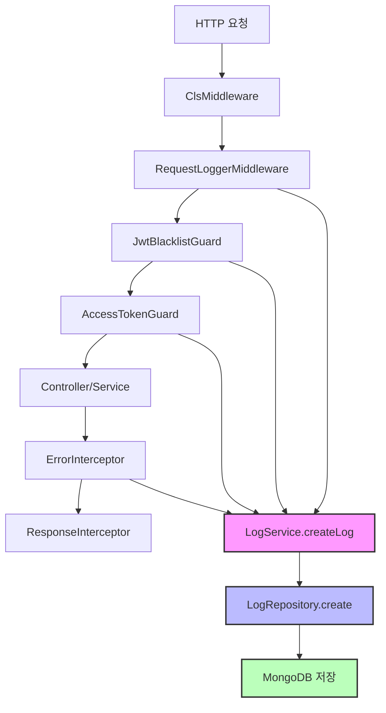
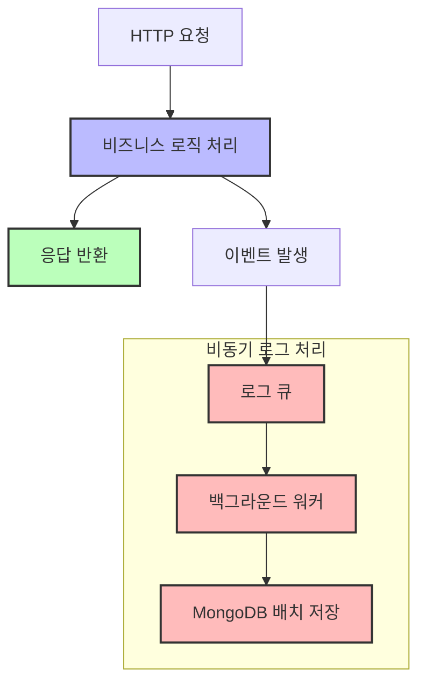

# MongoDB를 활용한 로그 적재 시스템 구축 가이드

## 📋 목차
1. [프로젝트 구조 분석](#1-프로젝트-구조-분석)
2. [로그 적재 플로우 분석](#2-로그-적재-플로우-분석)
3. [현재 구조의 문제점](#3-현재-구조의-문제점)
4. [비동기 처리 개선 아키텍처](#4-비동기-처리-개선-아키텍처)
5. [로그 적재 시 고려사항](#5-로그-적재-시-고려사항)
6. [코드 구현 시 주의사항](#6-코드-구현-시-주의사항)

---

## 1. 프로젝트 구조 분석

### 1.1 핵심 로그 관련 파일 구조

```
src/
├── schemas/log/
│   ├── log.schema.ts          # MongoDB 로그 스키마 정의
│   └── log.interface.ts       # 로그 레벨 상수 정의
├── modules/log/
│   ├── log.service.ts         # 로그 생성 비즈니스 로직
│   └── repository/
│       └── log.repository.ts  # MongoDB 로그 저장 로직
├── core/
│   ├── middleware/
│   │   └── requestLogger.middleware.ts  # 요청/응답 로깅
│   ├── interceptor/
│   │   └── error.interceptor.ts         # 에러 로깅
│   └── guard/
│       ├── accessToken.guard.ts         # 인증 로깅
│       ├── jwtBlacklist.guard.ts       # 토큰 블랙리스트 로깅
│       └── refreshToken.guard.ts       # 리프레시 토큰 로깅
```

### 1.2 로그 데이터 구조

```typescript
// src/schemas/log/log.schema.ts
@Schema({ timestamps: true, versionKey: false, collection: 'logs' })
export class Log {
  @Prop({ type: String, required: true, index: true })
  serviceName: string;        // 서비스 이름

  @Prop({ type: String, required: true, enum: Object.values(LogLevels), index: true })
  level: LogLevels;          // 로그 레벨 (ERROR, WARN, INFO, DEBUG, TRACE)

  @Prop({ type: String, required: true })
  message: string;           // 로그 메시지

  @Prop({ type: String, required: true, index: true })
  requestId: string;         // 요청 추적을 위한 고유 ID

  @Prop({ type: LogError })
  error?: LogError;          // 에러 정보 (스택 트레이스 포함)

  @Prop({ type: LogContext })
  context: LogContext;       // 요청 컨텍스트 정보
}
```

---

## 2. 로그 적재 플로우 분석

### 2.1 전체 로그 적재 플로우



### 2.2 세부 로그 적재 과정

#### 2.2.1 요청 시작 로그 (RequestLoggerMiddleware)
```typescript
// src/core/middleware/requestLogger.middleware.ts:23-39
async use(req: Request, res: Response, next: NextFunction): Promise<void> {
  const startTime = Date.now();
  const requestId = this.requestContextService.getRequestId();  // CLS에서 요청 ID 생성
  
  // 요청 시작 로그 생성 (동기 처리)
  await this.createLog(requestId, `Start Request: ${method} ${originalUrl}`, {
    url: originalUrl,
    method,
    body,
    query,
    ip,
    userAgent,
  });
  
  // 요청 완료 시 로그 생성 (비동기 처리)
  res.on('finish', async () => {
    await this.createLog(requestId, `Finish Request: ${method} ${originalUrl}`, {
      method,
      url: originalUrl,
      statusCode: res.statusCode,
      duration: Date.now() - startTime,
    });
  });
}
```

#### 2.2.2 인증 성공 로그 (AccessTokenGuard)
```typescript
// src/core/guard/accessToken.guard.ts:43-58
handleRequest(err: any, user: any) {
  if (err) throw new UnauthorizedException(err.message);
  if (!user) throw new UnauthorizedException('invalid token');

  // 콘솔 로그 (Winston)
  this.loggerService.info(
    this.handleRequest.name,
    `AccessTokenGuard Success: userId: ${user.id}`,
  );

  // MongoDB 로그 저장 (동기 처리)
  const requestId = this.requestContextService.getRequestId();
  this.logService.createLog(
    LogLevels.INFO,
    `AccessTokenGuard Success: userId: ${user.id}`,
    requestId,
  );
  return user;
}
```

#### 2.2.3 에러 로그 (ErrorInterceptor)
```typescript
// src/core/interceptor/error.interceptor.ts:18-52
private async createLog(context: ExecutionContext, err: HttpException, statusCode: number) {
  const requestId = context.switchToHttp().getRequest().headers['x-request-id'];
  const callClass = context.getClass().name;
  const callMethod = context.getHandler().name;
  
  // 에러 로그 저장 (동기 처리)
  await this.logService.createLog(
    LogLevels.ERROR,
    `Error: ${method} ${url}, ${callClass}.${callMethod}, ${err.message}`,
    requestId,
    {
      callClass,
      callMethod,
      method,
      url,
      body,
      query,
      statusCode,
    },
    {
      message: err.message,
      stack: err.stack || '',
      name: err.name,
    },
  );
}
```

#### 2.2.4 로그 저장 로직 (LogService)
```typescript
// src/modules/log/log.service.ts:20-45
async createLog(
  level: LogLevels,
  message: string,
  requestId: string,
  context?: Log['context'],
  error?: Log['error'],
): Promise<void> {
  try {
    const logObj = {
      serviceName: this.serviceName,
      level,
      message,
      requestId,
      context,
      error,
    };
    const logModel = Log.toInstance(logObj);
    
    // MongoDB에 동기적으로 저장
    await this.logRepository.create(logModel);
  } catch (error) {
    // 로그 저장 실패 시 Winston 로거로 에러 기록
    this.loggerService.error(
      this.createLog.name,
      error,
      'Failed to create log',
    );
  }
}
```

---

## 3. 현재 구조의 문제점

### 3.1 동기 처리로 인한 성능 문제

#### 📊 성능 영향 분석
- **요청 처리 시간 증가**: 각 로그 저장 시 MongoDB 쓰기 완료까지 대기
- **처리량 저하**: 로그 저장 시간만큼 전체 응답 시간 증가
- **리소스 점유**: 로그 저장 중 스레드 블로킹

#### 🔍 구체적인 문제점
1. **미들웨어에서의 await 사용**
```typescript
// ❌ 문제: 요청 시작 시 로그 저장 완료까지 대기
await this.createLog(requestId, `Start Request: ${method} ${originalUrl}`, context);
```

2. **Guard에서의 동기 처리**
```typescript
// ❌ 문제: 인증 성공 후 로그 저장 완료까지 대기
this.logService.createLog(LogLevels.INFO, message, requestId);
```

3. **에러 인터셉터에서의 await 사용**
```typescript
// ❌ 문제: 에러 응답 전 로그 저장 완료까지 대기
await this.logService.createLog(LogLevels.ERROR, message, requestId, context, error);
```

### 3.2 시스템 장애 전파 위험

#### 🚨 장애 시나리오
1. **MongoDB 연결 실패**
   - 모든 요청이 로그 저장 시도로 인해 지연
   - 서비스 전체 성능 저하

2. **로그 저장 오류**
   - 트랜잭션 롤백 위험
   - 사용자 요청 처리 중단

3. **네트워크 지연**
   - MongoDB 응답 지연 시 전체 시스템 응답 지연

### 3.3 확장성 제약

#### 📈 트래픽 증가 시 문제점
- **동시 연결 수 제한**: 로그 저장으로 인한 연결 점유 시간 증가
- **메모리 사용량 증가**: 대기 중인 요청들의 메모리 누적
- **CPU 사용률 증가**: 동기 처리로 인한 컨텍스트 스위칭 오버헤드

---

## 4. 비동기 처리 개선 아키텍처

### 4.1 개선된 아키텍처 설계



### 4.2 구체적인 개선 방안

#### 4.2.1 방안 1: 이벤트 기반 비동기 처리

```typescript
// 개선된 LogService
@Injectable()
export class LogService {
  constructor(
    private eventEmitter: EventEmitter2,
    private logRepository: LogRepository,
  ) {}

  // 즉시 반환하는 로그 생성 메서드
  createLogAsync(
    level: LogLevels,
    message: string,
    requestId: string,
    context?: Log['context'],
    error?: Log['error'],
  ): void {
    // 이벤트 발생 (논블로킹)
    this.eventEmitter.emit('log.created', {
      level,
      message,
      requestId,
      context,
      error,
      timestamp: new Date(),
    });
  }

  // 이벤트 리스너 (백그라운드 처리)
  @OnEvent('log.created')
  async handleLogCreated(logData: CreateLogEvent): Promise<void> {
    try {
      const logObj = {
        serviceName: this.serviceName,
        ...logData,
      };
      const logModel = Log.toInstance(logObj);
      await this.logRepository.create(logModel);
    } catch (error) {
      // 실패 시 재시도 로직 또는 데드 레터 큐 처리
      this.handleLogFailure(logData, error);
    }
  }
}
```

#### 4.2.2 방안 2: 큐 기반 배치 처리

```typescript
// 큐 기반 로그 처리 서비스
@Injectable()
export class QueuedLogService {
  private logQueue: CreateLogEvent[] = [];
  private batchSize = 100;
  private flushInterval = 1000; // 1초

  constructor(private logRepository: LogRepository) {
    // 주기적으로 큐 플러시
    setInterval(() => this.flushLogs(), this.flushInterval);
  }

  // 큐에 추가 (즉시 반환)
  addLog(logData: CreateLogEvent): void {
    this.logQueue.push(logData);
    
    // 배치 크기 도달 시 즉시 플러시
    if (this.logQueue.length >= this.batchSize) {
      this.flushLogs();
    }
  }

  // 배치 저장
  private async flushLogs(): Promise<void> {
    if (this.logQueue.length === 0) return;

    const logs = this.logQueue.splice(0, this.batchSize);
    try {
      await this.logRepository.createBatch(logs);
    } catch (error) {
      // 실패한 로그들을 재시도 큐에 추가
      this.handleBatchFailure(logs, error);
    }
  }
}
```

#### 4.2.3 방안 3: Redis 기반 로그 큐

```typescript
// Redis 큐를 활용한 로그 처리
@Injectable()
export class RedisLogService {
  constructor(
    @Inject('REDIS_CLIENT') private redis: Redis,
    private logRepository: LogRepository,
  ) {}

  // Redis 큐에 추가 (비동기)
  async enqueueLog(logData: CreateLogEvent): Promise<void> {
    await this.redis.lpush('log_queue', JSON.stringify(logData));
  }

  // 백그라운드 워커에서 처리
  @Cron('*/5 * * * * *') // 5초마다 실행
  async processLogQueue(): Promise<void> {
    const logs = await this.redis.brpop('log_queue', 10, 1); // 10개까지 처리
    
    if (logs && logs.length > 0) {
      const logBatch = logs.map(log => JSON.parse(log));
      await this.logRepository.createBatch(logBatch);
    }
  }
}
```

### 4.3 미들웨어 개선 예시

```typescript
// 개선된 RequestLoggerMiddleware
@Injectable()
export class RequestLoggerMiddleware implements NestMiddleware {
  constructor(
    private readonly queuedLogService: QueuedLogService,
    private readonly requestContextService: RequestContextService,
  ) {}

  // 논블로킹 로그 생성
  private createLogAsync(
    requestId: string,
    message: string,
    context: Log['context'],
  ): void {
    // 큐에 추가만 하고 즉시 반환
    this.queuedLogService.addLog({
      level: LogLevels.INFO,
      message,
      requestId,
      context,
      timestamp: new Date(),
    });
  }

  async use(req: Request, res: Response, next: NextFunction): Promise<void> {
    const startTime = Date.now();
    const requestId = this.requestContextService.getRequestId();
    
    // ✅ 개선: 비동기 로그 생성 (논블로킹)
    this.createLogAsync(requestId, `Start Request: ${method} ${originalUrl}`, context);

    res.on('finish', () => {
      // ✅ 개선: 응답 완료 후 비동기 로그 생성
      this.createLogAsync(requestId, `Finish Request: ${method} ${originalUrl}`, {
        method,
        url: originalUrl,
        statusCode: res.statusCode,
        duration: Date.now() - startTime,
      });
    });

    next(); // 즉시 다음 미들웨어로 진행
  }
}
```

---

## 5. 로그 적재 시 고려사항

### 5.1 데이터 설계 고려사항

#### 5.1.1 인덱스 설계
```javascript
// MongoDB 인덱스 설정 예시
db.logs.createIndex({ "level": 1, "createdAt": -1 })        // 로그 레벨별 최신순 조회
db.logs.createIndex({ "requestId": 1 })                     // 요청 ID별 조회
db.logs.createIndex({ "serviceName": 1, "createdAt": -1 })  // 서비스별 최신순 조회
db.logs.createIndex({ "context.callClass": 1, "context.callMethod": 1 }) // 클래스/메서드별 조회
```

#### 5.1.2 데이터 보존 정책
```javascript
// TTL 인덱스 설정 (90일 후 자동 삭제)
db.logs.createIndex({ "createdAt": 1 }, { expireAfterSeconds: 7776000 })

// 로그 레벨별 보존 기간 설정
db.logs.createIndex({ "createdAt": 1 }, { 
  expireAfterSeconds: 2592000,  // ERROR 로그: 30일
  partialFilterExpression: { "level": "ERROR" }
})
```

### 5.2 성능 최적화 고려사항

#### 5.2.1 배치 처리
```typescript
// 배치 크기 최적화
interface BatchConfig {
  size: number;           // 배치 크기 (권장: 100-1000)
  timeout: number;        // 최대 대기 시간 (권장: 1-5초)
  maxRetries: number;     // 재시도 횟수 (권장: 3회)
  backoffMultiplier: number; // 백오프 배수 (권장: 2)
}

const batchConfig: BatchConfig = {
  size: 500,
  timeout: 2000,
  maxRetries: 3,
  backoffMultiplier: 2,
};
```

#### 5.2.2 메모리 관리
```typescript
// 메모리 사용량 제한
interface MemoryConfig {
  maxQueueSize: number;    // 최대 큐 크기
  warningThreshold: number; // 경고 임계값
  flushThreshold: number;   // 강제 플러시 임계값
}

const memoryConfig: MemoryConfig = {
  maxQueueSize: 10000,
  warningThreshold: 8000,
  flushThreshold: 9000,
};
```

### 5.3 안정성 고려사항

#### 5.3.1 실패 처리 전략
```typescript
// 지수 백오프 재시도
class RetryStrategy {
  async retryWithBackoff<T>(
    operation: () => Promise<T>,
    maxRetries: number,
    baseDelay: number = 1000,
  ): Promise<T> {
    for (let attempt = 0; attempt < maxRetries; attempt++) {
      try {
        return await operation();
      } catch (error) {
        if (attempt === maxRetries - 1) throw error;
        
        const delay = baseDelay * Math.pow(2, attempt);
        await new Promise(resolve => setTimeout(resolve, delay));
      }
    }
  }
}
```

#### 5.3.2 데드 레터 큐
```typescript
// 실패한 로그 처리
@Injectable()
export class DeadLetterLogService {
  async handleFailedLog(logData: CreateLogEvent, error: Error): Promise<void> {
    // 실패한 로그를 별도 컬렉션에 저장
    await this.failedLogRepository.create({
      ...logData,
      error: error.message,
      failedAt: new Date(),
    });
    
    // 알림 발송
    await this.notificationService.sendAlert({
      type: 'LOG_FAILURE',
      message: `로그 저장 실패: ${error.message}`,
      logData,
    });
  }
}
```

---

## 6. 코드 구현 시 주의사항

### 6.1 성능 최적화 팁

#### 6.1.1 불필요한 데이터 저장 방지
```typescript
// ❌ 나쁜 예: 모든 데이터를 저장
const logData = {
  body: req.body,           // 큰 파일 업로드 시 메모리 낭비
  headers: req.headers,     // 민감한 정보 포함 가능
  query: req.query,         // 불필요한 쿼리 파라미터
};

// ✅ 좋은 예: 필요한 데이터만 선별적 저장
const logData = {
  body: this.sanitizeBody(req.body),       // 민감한 정보 제거
  userAgent: req.headers['user-agent'],    // 필요한 헤더만 선택
  query: this.sanitizeQuery(req.query),    // 중요한 쿼리만 선택
};
```

#### 6.1.2 메모리 효율적인 데이터 처리
```typescript
// 메모리 사용량 최적화
class LogDataOptimizer {
  sanitizeBody(body: any): any {
    if (!body) return undefined;
    
    // 파일 업로드 데이터 제거
    if (body.file || body.files) {
      return { ...body, file: '[FILE_REMOVED]', files: '[FILES_REMOVED]' };
    }
    
    // 큰 문자열 제한
    const maxLength = 1000;
    Object.keys(body).forEach(key => {
      if (typeof body[key] === 'string' && body[key].length > maxLength) {
        body[key] = body[key].substring(0, maxLength) + '...';
      }
    });
    
    return body;
  }
}
```

### 6.2 보안 고려사항

#### 6.2.1 민감한 정보 제거
```typescript
// 민감한 정보 필터링
class SecurityFilter {
  private sensitiveFields = [
    'password', 'token', 'secret', 'key', 'authorization',
    'cookie', 'session', 'credit_card', 'ssn', 'phone'
  ];

  sanitizeData(data: any): any {
    if (!data || typeof data !== 'object') return data;
    
    const sanitized = { ...data };
    
    Object.keys(sanitized).forEach(key => {
      if (this.isSensitiveField(key)) {
        sanitized[key] = '[REDACTED]';
      } else if (typeof sanitized[key] === 'object') {
        sanitized[key] = this.sanitizeData(sanitized[key]);
      }
    });
    
    return sanitized;
  }

  private isSensitiveField(fieldName: string): boolean {
    return this.sensitiveFields.some(sensitive => 
      fieldName.toLowerCase().includes(sensitive.toLowerCase())
    );
  }
}
```

#### 6.2.2 개인정보 보호
```typescript
// 개인정보 마스킹
class PersonalDataMasker {
  maskEmail(email: string): string {
    if (!email || !email.includes('@')) return email;
    
    const [username, domain] = email.split('@');
    if (username.length <= 2) return email;
    
    return `${username.substring(0, 2)}***@${domain}`;
  }

  maskPhoneNumber(phone: string): string {
    if (!phone || phone.length < 8) return phone;
    
    return phone.replace(/(\d{3})\d{4}(\d{4})/, '$1****$2');
  }

  maskData(data: any): any {
    if (!data || typeof data !== 'object') return data;
    
    const masked = { ...data };
    
    Object.keys(masked).forEach(key => {
      if (key.toLowerCase().includes('email')) {
        masked[key] = this.maskEmail(masked[key]);
      } else if (key.toLowerCase().includes('phone')) {
        masked[key] = this.maskPhoneNumber(masked[key]);
      }
    });
    
    return masked;
  }
}
```

### 6.3 모니터링 및 관찰성

#### 6.3.1 메트릭 수집
```typescript
// 로그 시스템 메트릭
@Injectable()
export class LogMetricsService {
  private logCounter = 0;
  private errorCounter = 0;
  private processingTime: number[] = [];

  incrementLogCounter(level: LogLevels): void {
    this.logCounter++;
    if (level === LogLevels.ERROR) {
      this.errorCounter++;
    }
  }

  recordProcessingTime(duration: number): void {
    this.processingTime.push(duration);
    
    // 최근 1000개 데이터만 유지
    if (this.processingTime.length > 1000) {
      this.processingTime.shift();
    }
  }

  getMetrics(): LogMetrics {
    return {
      totalLogs: this.logCounter,
      errorLogs: this.errorCounter,
      averageProcessingTime: this.calculateAverage(this.processingTime),
      maxProcessingTime: Math.max(...this.processingTime),
      minProcessingTime: Math.min(...this.processingTime),
    };
  }
}
```

#### 6.3.2 헬스 체크
```typescript
// 로그 시스템 헬스 체크
@Injectable()
export class LogHealthService {
  constructor(
    private logRepository: LogRepository,
    private metricsService: LogMetricsService,
  ) {}

  async checkHealth(): Promise<HealthCheckResult> {
    const checks = await Promise.allSettled([
      this.checkDatabaseConnection(),
      this.checkQueueHealth(),
      this.checkProcessingPerformance(),
    ]);

    const results = checks.map(check => 
      check.status === 'fulfilled' ? check.value : { status: 'unhealthy', error: check.reason }
    );

    return {
      status: results.every(r => r.status === 'healthy') ? 'healthy' : 'unhealthy',
      checks: results,
      timestamp: new Date().toISOString(),
    };
  }

  private async checkDatabaseConnection(): Promise<HealthCheck> {
    try {
      await this.logRepository.ping();
      return { status: 'healthy', component: 'database' };
    } catch (error) {
      return { status: 'unhealthy', component: 'database', error: error.message };
    }
  }
}
```

---

## 🎯 핵심 요약

### ✅ 반드시 기억해야 할 사항

1. **비동기 처리**: 로그 저장은 비즈니스 로직과 분리하여 비동기로 처리
2. **배치 처리**: 개별 로그보다 배치 단위로 처리하여 성능 최적화
3. **실패 처리**: 로그 저장 실패가 서비스 전체에 영향을 주지 않도록 설계
4. **보안**: 민감한 정보는 반드시 필터링하여 저장
5. **모니터링**: 로그 시스템 자체의 상태를 지속적으로 모니터링

### 🚀 성능 최적화 체크리스트

- [ ] 동기 처리를 비동기 처리로 전환
- [ ] 배치 처리 구현
- [ ] 메모리 사용량 제한
- [ ] 인덱스 최적화
- [ ] TTL 설정으로 자동 정리
- [ ] 실패 재시도 로직 구현
- [ ] 메트릭 수집 및 모니터링

### 🔐 보안 체크리스트

- [ ] 민감한 데이터 필터링
- [ ] 개인정보 마스킹
- [ ] 로그 접근 권한 제한
- [ ] 로그 보존 기간 설정
- [ ] 감사 로그 분리 저장

이 가이드를 따라 구현하면 안정적이고 확장 가능한 MongoDB 로그 적재 시스템을 구축할 수 있습니다. 각 단계별로 테스트를 진행하며 점진적으로 개선해 나가시기 바랍니다.

<function_calls>
<invoke name="TodoWrite">
<parameter name="todos">[{"id": "1", "content": "\ud504\ub85c\uc81d\ud2b8 \uad6c\uc870 \ubd84\uc11d \ubc0f \ud30c\uc77c \ud0d0\uc0c9", "status": "completed", "priority": "high"}, {"id": "2", "content": "MongoDB \ub85c\uadf8 \uc801\uc7ac \uad00\ub828 \ucf54\ub4dc \ubd84\uc11d", "status": "completed", "priority": "high"}, {"id": "3", "content": "\ub85c\uadf8 \uc801\uc7ac \ud50c\ub85c\uc6b0 \ubd84\uc11d \ubc0f \uc815\ub9ac", "status": "completed", "priority": "high"}, {"id": "4", "content": "\ud604\uc7ac \uad6c\uc870\uc758 \ubb38\uc81c\uc810 \ud30c\uc545 (\ub3d9\uae30 \ucc98\ub9ac)", "status": "completed", "priority": "high"}, {"id": "5", "content": "\ube44\ub3d9\uae30 \ucc98\ub9ac \uac1c\uc120 \uc544\ud0a4\ud14d\ucc98 \uc124\uacc4", "status": "completed", "priority": "high"}, {"id": "6", "content": "\uc218\uac15\uc0dd\uc6a9 \uac00\uc774\ub4dc \ubb38\uc11c \uc791\uc131", "status": "completed", "priority": "high"}]